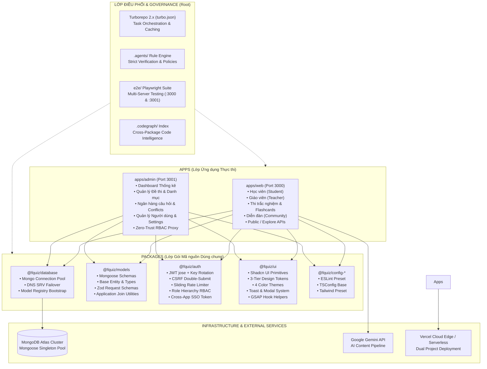
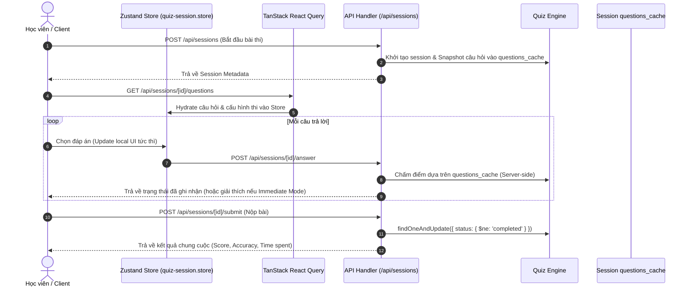

# 🏗️ FQuiz — System Architecture Documentation (`docs/ARCHITECTURE.md`)

> **Phiên bản**: 2.0.0 (Pure Symmetrical Monorepo Architecture)  
> **Trạng thái**: Bản thiết kế kiến trúc chuẩn hóa toàn diện (Master Architecture Specification)  
> **Ngăn xếp công nghệ**: Next.js 16 App Router (Turbopack), Turborepo 2.x, React 18, Tailwind CSS 3, MongoDB / Mongoose 9, TypeScript 5, Playwright, Jest, GitHub Actions CI/CD.

---

## 1. TỔNG QUAN KIẾN TRÚC (ARCHITECTURAL OVERVIEW)

Kiến trúc **Full Monorepo (Pure Symmetrical Monorepo)** của nền tảng FQuiz phân định rõ ràng **3 lớp thực thể** trong cùng một kho chứa mã nguồn duy nhất:

1. **Lớp Ứng dụng Thực thi (`apps/*`)**:
   - `apps/web`: Ứng dụng Web dành cho Học viên, Giáo viên, Khách vãng lai và Diễn đàn cộng đồng (Port 3000 / `https://fquiz-web.vercel.app`).
   - `apps/admin`: Cổng Quản trị Hệ thống độc lập với Zero-Trust RBAC Proxy (Port 3001 / `https://fquiz-admin.vercel.app`).
2. **Lớp Gói Mã nguồn Dùng chung (`packages/*`)**:
   - `packages/database`: Singleton kết nối MongoDB Atlas, DNS SRV fallback, Connection Pool, Model Registry.
   - `packages/models`: Single Source of Truth cho toàn bộ Mongoose Schemas, Base Entity, Interfaces và Zod validation.
   - `packages/auth`: Bộ công cụ Bảo mật & Xác thực (JWT Rotation, Crypto, Double-Submit CSRF, Rate Limiting, Role Hierarchy, SSO).
   - `packages/ui`: Thư viện giao diện dùng chung (Shadcn primitives, Design Tokens CSS Variables, Toast store, Theme Provider, GSAP helpers).
   - `packages/config-typescript` & `packages/config-eslint`: Cấu hình linting và trình biên dịch dùng chung.
3. **Lớp Điều phối Trung tâm (`.` - Root Workspace)**:
   - Chỉ đóng vai trò điều phối pipeline build, test, lint thông qua **Turborepo** và kiểm định quy tắc thông qua **AI Governance Rule Engine** (`.agents/scripts/`).



---

## 2. NGUYÊN TẮC THIẾT KẾ BẤT BIẾN (CORE ARCHITECTURAL INVARIANTS)

Để đảm bảo chất lượng kỹ thuật, tính ổn định và khả năng mở rộng lâu dài, mọi thành phần trong hệ thống bắt buộc phải tuân thủ nghiêm ngặt **8 nguyên tắc bất biến**:

1. **Text-Only Learning Scope Boundary**: Nền tảng FQuiz chỉ phục vụ học tập, thi trắc nghiệm và ôn luyện qua văn bản (từ vựng, ngữ pháp, câu hỏi, đáp án, giải thích chi tiết, bài đọc hiểu, flashcards). **Tuyệt đối không đưa vào hệ thống các tính năng âm thanh, nhận dạng giọng nói (TTS/STT), OCR, 3D WebGL, VR hoặc multimedia nặng**.
2. **Không import chéo Model giữa các Module & Ứng dụng**: 
   - `apps/web` và `apps/admin` tuyệt đối không được tham chiếu trực tiếp mã nguồn của nhau.
   - Các business module (`auth`, `quiz`, `classroom`, `community`, `ai`) chỉ được import model do chính mình định nghĩa hoặc thông qua gói dùng chung `@fquiz/models`.
3. **Cấm Mongoose `.populate()`**: Mọi truy vấn liên kết dữ liệu giữa các bảng bắt buộc phải thực hiện ở tầng ứng dụng (**Application-level join**) thông qua truy vấn batch `$in`. Điều này ngăn chặn triệt để query bloat, lock bảng và phụ thuộc chặt chẽ giữa các collection.
4. **Động cơ Thi Server-Authoritative & Chống Race Condition**: Trạng thái phòng thi, thời gian còn lại, việc tính điểm và tổng kết kết quả thi cử hoàn toàn do Server quyết định dựa trên `session.questions_cache`. Các thao tác chuyển trạng thái bắt buộc sử dụng `findOneAndUpdate` nguyên tử kèm điều kiện `{ status: { $ne: 'completed' } }` để chống gửi trùng lặp (Double Submit) và Race Condition.
5. **Cache & Deduplication Nội dung AI**: Trước khi gọi Google Gemini API, hệ thống luôn băm SHA-256 nội dung yêu cầu (`requestHash`) để đối soát với collection `AIAsset`. Nếu đã tồn tại kết quả tương ứng, trả về ngay dữ liệu từ cache mà không tiêu tốn quota gọi AI.
6. **Single Source of Truth cho Schemas & Data Types**: Toàn bộ định nghĩa Mongoose Schemas, Base Entity, TypeScript Interfaces và Zod Validation Schemas được tập trung duy nhất tại package `@fquiz/models`. Cả Web và Admin đều sử dụng chung một schema chuẩn để triệt tiêu Schema Drift.
7. **Bảo mật Zero-Trust & Phân quyền Đa tầng**:
   - Token JWT được ký và xác thực bằng `jose` với cơ chế xoay vòng khóa không gián đoạn dịch vụ (**Zero-Downtime Key Rotation**: `JWT_SECRET` + `JWT_SECRET_PREV`).
   - Mọi mutation API yêu cầu Double-Submit CSRF token (`csrf-token` cookie + `x-csrf-token` header).
   - Bảo vệ toàn bộ endpoint nhạy cảm bằng Sliding Window Rate Limiter và RBAC Zero-Trust Proxy.
8. **Chuẩn Design Tokens 3-Tier & GPU-Accelerated Animations**:
   - Toàn bộ giao diện sử dụng hệ thống Design Tokens 3 cấp (Global Base Tokens → Semantic Design Tokens → Component Scoped Tokens) hỗ trợ 4 giao diện chuẩn (Light, Dark, Slate-Green, Slate-Pink) đạt chuẩn tương phản **WCAG 2.2 AA**.
   - Mọi animation micro-interaction tích hợp qua `@gsap/react` với hook `useGSAP()`, chỉ can thiệp vào các thuộc tính GPU transform (`x`, `y`, `scale`, `rotation`, `autoAlpha`), tự động dọn dẹp context khi unmount và tôn trọng thiết lập `prefers-reduced-motion`.

---

## 3. BẢN ĐỒ CẤU TRÚC THƯ MỤC CHI TIẾT (EXHAUSTIVE DIRECTORY LAYOUT)

```
fquiz/
├── apps/
│   ├── web/                               # 🎓 Web Học viên, Giáo viên & Diễn đàn (Port 3000)
│   │   ├── app/                           # Next.js 16 App Router
│   │   │   ├── (auth)/                    # Login, Register, Forgot-Password, Restore Account
│   │   │   ├── (student)/                 # Dashboard, My Quizzes, History, Classrooms, Settings
│   │   │   ├── (teacher)/                 # Classrooms, Quizzes, Assignments, Reports
│   │   │   ├── quiz/                      # Động cơ thi trắc nghiệm (Immediate, Review, Flashcard, Mobile)
│   │   │   ├── community/                 # Diễn đàn trao đổi học thuật (Posts, Comments, Likes)
│   │   │   ├── explore/                   # Khám phá danh mục & đề thi công khai
│   │   │   └── api/                       # Web REST APIs & Next.js Server Actions
│   │   ├── components/                    # Web-specific Components (Quiz, Classroom, Community, AI)
│   │   ├── hooks/                         # Web React Hooks (useSessionAnswerSync, useSubmitAnswer)
│   │   ├── store/                         # Zustand Stores (quiz-session.store.ts)
│   │   ├── lib/                           # Web Feature Business Services (AIContentService, QuizEngine)
│   │   ├── proxy.ts                       # Web Edge Proxy Middleware (Redirect /admin, Security Headers)
│   │   ├── next.config.js                 # Next.js 16 Web Config (Transpile packages, CSP, Turbopack)
│   │   ├── tailwind.config.ts             # Tailwind CSS (kế thừa preset từ @fquiz/ui)
│   │   ├── tsconfig.json                  # TSConfig (kế thừa từ @fquiz/config-typescript)
│   │   ├── vercel.json                    # Cấu hình Vercel Web Cron & Header
│   │   └── package.json                   # name: "@fquiz/web"
│   │
│   └── admin/                             # 🛡️ Cổng Quản trị Hệ thống (Port 3001)
│       ├── app/                           # Next.js 16 App Router (Slim Orchestrators <90 dòng)
│       │   ├── (dashboard)/               # Categories, Feedback, Question Bank, Quizzes, Settings, Users
│       │   ├── login/                     # Trang đăng nhập Admin riêng biệt
│       │   └── api/                       # Admin REST APIs (CRUD Quizzes, Users, Migrations, Status)
│       ├── components/                    # Admin UI Components (Panels, Tables, Conflict Resolvers)
│       ├── hooks/                         # Admin Hooks (useAdminQuizzes, useQuestionBankAnalytics)
│       ├── proxy.ts                       # Zero-Trust Admin Proxy Middleware (RBAC Guard)
│       ├── next.config.js                 # Next.js 16 Admin Config
│       ├── tailwind.config.ts             # Tailwind CSS (kế thừa preset từ @fquiz/ui)
│       ├── tsconfig.json                  # TSConfig
│       ├── vercel.json                    # Cấu hình Region sin1 cho Admin
│       └── package.json                   # name: "@fquiz/admin"
│
├── packages/
│   ├── database/                          # 🗄️ Database Singleton & Connection Management
│   │   ├── src/
│   │   │   ├── mongodb.ts                 # Mongoose Singleton Connection với DNS SRV Failover
│   │   │   ├── model-registry.ts          # Lazy Model Bootstrap ngăn chặn MissingSchemaError
│   │   │   ├── base-schema.ts             # Base schema plugin (timestamps, soft delete, status)
│   │   │   └── index.ts                   # Entry point export database utilities
│   │   ├── tsconfig.json
│   │   └── package.json                   # name: "@fquiz/database"
│   │
│   ├── models/                            # 📦 Single Source of Truth cho Data Models
│   │   ├── src/
│   │   │   ├── entities/                  # Base Entity, Interfaces, Enums
│   │   │   │   ├── base-entity.ts         # IBaseEntity interface
│   │   │   │   └── index.ts
│   │   │   ├── models/                    # Mongoose Models
│   │   │   │   ├── user.model.ts          # User Model & Roles
│   │   │   │   ├── quiz.model.ts          # Quiz & Question Embedded Models
│   │   │   │   ├── quiz-session.model.ts  # QuizSession Model (Server-side tracking)
│   │   │   │   ├── question-bank.model.ts # QuestionBank Model (Dedup SHA-256)
│   │   │   │   ├── category.model.ts      # Category Model
│   │   │   │   ├── feedback.model.ts      # Feedback Model
│   │   │   │   ├── classroom.model.ts     # Classroom & Assignment Models
│   │   │   │   ├── community.model.ts     # Post & Comment Models
│   │   │   │   ├── ai-asset.model.ts      # AIAsset Model (Prompt Deduplication)
│   │   │   │   └── site-settings.model.ts # SiteSettings Model (System Config)
│   │   │   ├── schemas/                   # Zod Request Schemas & DTO Validation
│   │   │   ├── utils/                     # SHA-256 Fingerprinting & Join Helpers
│   │   │   │   ├── question-fingerprint.ts# generateQuestionId & generateQuestionFingerprint
│   │   │   │   └── join-helper.ts         # Batch $in application-level join utility
│   │   │   └── index.ts                   # Entry point export all models, schemas & utils
│   │   ├── tsconfig.json
│   │   └── package.json                   # name: "@fquiz/models"
│   │
│   ├── auth/                              # 🔐 Security, JWT & Auth Infrastructure
│   │   ├── src/
│   │   │   ├── jwt.ts                     # JWT Verify & Sign với Zero-Downtime Rotation (jose)
│   │   │   ├── csrf.ts                    # Double-Submit CSRF Validation & Token Generator
│   │   │   ├── crypto.ts                  # Password Hashing (bcryptjs) & Safe Token Generation
│   │   │   ├── rate-limit.ts              # Sliding Window Memory Rate Limiter
│   │   │   ├── rbac.ts                    # Role Hierarchy, Permissions & Auth Guards
│   │   │   ├── with-auth.ts               # Higher-Order Function bảo vệ API Route Handlers
│   │   │   └── index.ts                   # Entry point export all auth utilities
│   │   ├── tsconfig.json
│   │   └── package.json                   # name: "@fquiz/auth"
│   │
│   ├── ui/                                # 🎨 Shared UI Primitives & Design System
│   │   ├── src/
│   │   │   ├── components/                # Radix UI + Tailwind Primitives (Button, Card, Dialog, Badge...)
│   │   │   ├── theme/                     # 3-Tier Design Tokens, ThemeProvider, WCAG Contrast Checkers
│   │   │   ├── toast/                     # Zustand Toast Store & UI Toaster Component
│   │   │   ├── lib/                       # Utility functions (cn, animations)
│   │   │   ├── tailwind-preset.ts         # Tailwind Config Preset dùng chung cho các apps
│   │   │   └── index.ts                   # Entry point export all UI components & tokens
│   │   ├── tsconfig.json
│   │   └── package.json                   # name: "@fquiz/ui"
│   │
│   └── config-typescript/                 # ⚙️ Shared TypeScript Configs
│       ├── base.json                      # Cấu hình TypeScript cơ sở
│       ├── nextjs.json                    # Cấu hình TypeScript tối ưu cho Next.js 16
│       ├── react-library.json             # Cấu hình TypeScript cho React Component Libraries
│       └── package.json                   # name: "@fquiz/config-typescript"
│
├── e2e/                                   # 🧪 Multi-Server End-to-End Test Suite (Playwright)
├── .agents/                               # 🤖 AI Agent Governance & CI/CD Verification Engine
├── turbo.json                             # ⚡ Turborepo Task Pipeline & Cache Orchestration
└── package.json                           # 📦 Monorepo Root Package
```

---

## 4. MA TRẬN PHỤ THUỘC & RANH GIỚI GÓI (PACKAGE BOUNDARY MATRIX)

### 4.1. Bảng phân quyền tham chiếu giữa các Packages & Apps

| Từ Package / App | Có quyền Import | Tuyệt đối CẤM Import |
|---|---|---|
| `apps/web` | `@fquiz/database`, `@fquiz/models`, `@fquiz/auth`, `@fquiz/ui`, `@fquiz/config-*` | `apps/admin` |
| `apps/admin` | `@fquiz/database`, `@fquiz/models`, `@fquiz/auth`, `@fquiz/ui`, `@fquiz/config-*` | `apps/web` |
| `@fquiz/database` | `mongoose` | `apps/*`, `@fquiz/models`, `@fquiz/auth`, `@fquiz/ui` |
| `@fquiz/models` | `@fquiz/database`, `mongoose`, `zod` | `apps/*`, `@fquiz/auth`, `@fquiz/ui` |
| `@fquiz/auth` | `@fquiz/models`, `jose`, `bcryptjs` | `apps/*`, `@fquiz/ui` |
| `@fquiz/ui` | `react`, `lucide-react`, `@radix-ui/*`, `@gsap/react`, `zustand` | `apps/*`, `@fquiz/database`, `@fquiz/models`, `@fquiz/auth` |

### 4.2. Chuẩn Application-Level Join trong FQuiz (Thay thế hoàn toàn `.populate()`)

```typescript
// ✅ CHUẨN: Batch Application-Level Join với $in
import { Post, User } from '@fquiz/models'

export async function getPostsWithAuthors(limit = 20) {
  const posts = await Post.find().sort({ createdAt: -1 }).limit(limit).lean()
  if (posts.length === 0) return []

  const authorIds = [...new Set(posts.map((p) => p.authorId.toString()))]
  const users = await User.find({ _id: { $in: authorIds } })
    .select('_id name avatar role')
    .lean()

  const userMap = new Map(users.map((u) => [u._id.toString(), u]))

  return posts.map((post) => ({
    ...post,
    author: userMap.get(post.authorId.toString()) || {
      _id: post.authorId,
      name: 'Người dùng ẩn danh',
      role: 'student',
    },
  }))
}
```

---

## 5. LUỒNG DỮ LIỆU & STATE MANAGEMENT



- **Server State (TanStack Query v5)**: Quản lý fetching, caching, query deduplication và background revalidation cho toàn bộ dữ liệu từ REST API.
- **Client State (Zustand v5)**: Quản lý trạng thái tương tác với độ trễ 0ms (`quiz-session.store.ts` cho phòng thi có hỗ trợ đồng bộ Offline/LocalStorage, `toast-store.ts` cho hệ thống thông báo toast).

---

## 6. ĐỘNG CƠ TRÍ TUỆ NHÂN TẠO & DEDUPLICATION PIPELINE

### 6.1. AI Content Pipeline với Deduplication SHA-256
- Tích hợp Google Gemini API (hoặc OpenAI/Custom Endpoint) để tạo câu hỏi, flashcards, từ vựng, ngữ pháp và giải thích chi tiết.
- Cơ chế Cache 2 tầng thông qua collection `AIAsset`:
  1. Băm nội dung yêu cầu bằng `SHA-256` (`requestHash`).
  2. Tra cứu `AIAsset.findOne({ requestHash, aiProvider })`. Nếu tồn tại bản ghi hợp lệ, trả về kết quả ngay lập tức (0 quota consumption).
  3. Nếu chưa có, gọi AI sinh nội dung, validate cấu trúc bằng **Zod Schema**, lưu vào `AIAsset` và trả về Client.

### 6.2. Quiz AI Assistant (Trợ lý Phòng thi Thời gian thực)
- **Intent Resolver**: Phân loại ý định của học sinh (yêu cầu giải thích khái niệm, phân tích vì sao chọn sai, tìm câu hỏi tương tự).
- **Context Resolver**: Đóng gói nội dung câu hỏi hiện tại, phương án đã chọn và đáp án đúng làm ngữ cảnh cho AI.
- **Question Retriever**: Tìm kiếm các câu hỏi liên quan trong MongoDB Question Bank để minh họa.
- **Confidence Engine**: Đánh giá độ tin cậy và kiểm soát nội dung trước khi gửi trả lại cho học sinh.

---

## 7. BẢO MẬT, XÁC THỰC & SINGLE SIGN-ON (SSO)

- **Zero-Downtime Key Rotation**: Ký và xác thực JWT qua thư viện `jose` sử dụng đồng thời `JWT_SECRET` (khóa hiện tại) và `JWT_SECRET_PREV` (khóa trước đó). Khi đổi secret, người dùng đang đăng nhập không bị out phiên.
- **Double-Submit CSRF**: Tất cả API Mutations (`POST`, `PUT`, `DELETE`, `PATCH`) bắt buộc gửi kèm header `x-csrf-token` khớp với giá trị trong cookie `csrf-token`.
- **Sliding Window Rate Limiter**: Giới hạn tần suất gọi API công khai và endpoint nhạy cảm (Login, Register, AI Generate) theo địa chỉ IP và Token.
- **Cross-App SSO & Edge Proxies**:
  - `apps/web/proxy.ts`: Chuyển hướng truy cập `/admin` sang `NEXT_PUBLIC_ADMIN_URL` (`fquiz-admin.vercel.app`), cách ly `/api/admin` với mã lỗi 404.
  - `apps/admin/proxy.ts`: Zero-Trust RBAC Proxy kiểm tra nghiêm ngặt `role === 'admin'`. Token học sinh hoặc giáo viên truy cập sẽ bị từ chối với mã lỗi `403 Forbidden`.

---

## 8. HỆ SINH THÁI GIAO DIỆN 3-TIER TOKENS & GSAP ANIMATIONS

- **Hệ thống Design Tokens 3 cấp**:
  1. **Global Base Tokens**: Định nghĩa giá trị màu HSL nguyên bản.
  2. **Semantic Design Tokens**: Mapping các biến CSS ngữ nghĩa (`--background`, `--foreground`, `--primary`, `--card`, `--border`...).
  3. **Component Scoped Tokens**: Áp dụng trực tiếp vào components thông qua Tailwind classes.
- **4 Theme Chuẩn**: `Light`, `Dark`, `Slate-Green`, `Slate-Pink` đạt độ tương phản chuẩn **WCAG 2.2 AA (>= 4.5:1)**.
- **GSAP UI/UX Animation Standards**:
  - Tích hợp qua `@gsap/react` với hook `useGSAP({ scope: containerRef })`.
  - Chỉ animate các thuộc tính GPU transform (`x`, `y`, `scale`, `rotation`, `autoAlpha`).
  - Hỗ trợ `prefers-reduced-motion` thông qua `gsap.matchMedia()`.

---

## 9. QUẢN LÝ DỰ ÁN & VẬN HÀNH TRÊN VERCEL

- **Turborepo Task Pipeline (`turbo.json`)**:
  - `build`: Biên dịch song song `apps/web` và `apps/admin`, lưu trữ build artifacts.
  - `check-types`: Kiểm tra kiểu TypeScript toàn bộ 7 workspaces (`apps/*` & `packages/*`).
  - `lint`: Kiểm tra ESLint cho toàn bộ kho mã nguồn.
- **Dual Vercel Deployment**:
  - **Project 1 (Web)**: Root Directory = `apps/web`, Output Directory = `.next`, Domain = `fquiz-web.vercel.app`.
  - **Project 2 (Admin)**: Root Directory = `apps/admin`, Output Directory = `.next`, Domain = `fquiz-admin.vercel.app`.
- **Database Connection Pooling**: Mongoose Singleton Pool với cấu hình tự động DNS fallback `8.8.8.8, 1.1.1.1` khi mạng chập chờn.

---

## 10. CHIẾN LƯỢC KIỂM THỬ & AI GOVERNANCE ENGINE

- **Playwright Multi-Server E2E (`e2e/`)**: 16 kịch bản kiểm thử điều phối đồng thời cả 2 máy chủ Web (`:3000`) và Admin (`:3001`).
- **Jest Unit & Integration (`npm test`)**: 66 test suites với 430 test cases bao phủ toàn bộ Quiz Engine, AI Assistant, Auth, CSRF, Cache.
- **AI Agent Governance Engine (`node .agents/scripts/verify.js --strict`)**: 18 bài kiểm tra tự động chạy trên CI/CD GitHub Actions bảo đảm 100% tuân thủ TypeScript, ESLint, ranh giới module, không hardcoded secrets và chuẩn giao diện WCAG 2.2 AA.
