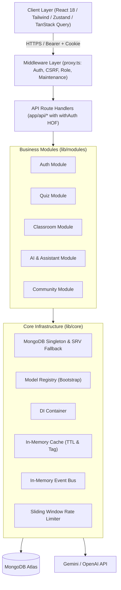
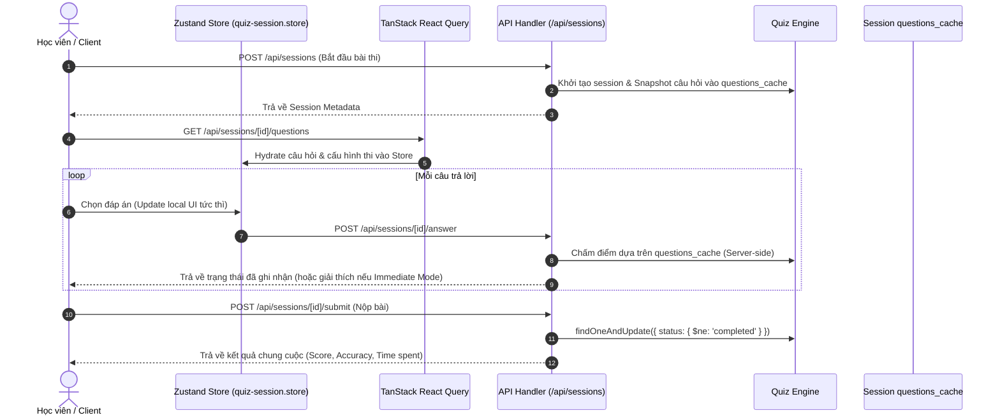

# 🏗️ FQuiz — System Architecture Documentation (`docs/ARCHITECTURE.md`)

Tài liệu thiết kế kiến trúc toàn diện của hệ thống **FQuiz**, mô tả nguyên lý thiết kế, ranh giới phân rã module, mô hình phân tầng, luồng xử lý dữ liệu và hạ tầng dùng chung.

---

## 1. Tổng quan Kiến trúc (Architectural Overview)

FQuiz được xây dựng theo mô hình **Turborepo Monorepo & Modular Monolith** trên nền tảng **Next.js 16 App Router** (Node.js runtime), bao gồm 2 workspace phân tách độc lập hoàn toàn:
1. **Web Học viên & Giáo viên (`.`)**: Port 3000 / `https://fquiz-web.vercel.app` — Nền tảng học tập, làm bài thi trắc nghiệm, quản lý lớp học và cộng đồng.
2. **Cổng Quản trị Admin (`apps/admin`)**: Port 3001 / `https://fquiz-admin.vercel.app` — Trung tâm điều hành quản lý người dùng, đề thi chuẩn, ngân hàng câu hỏi và cấu hình hệ thống.



---

## 2. Quy chuẩn Ranh giới Module (Module Boundary Standards)

Để đảm bảo tính độc lập và khả năng bảo trì lâu dài, FQuiz áp dụng các nguyên tắc kiến trúc nghiêm ngặt (được tự động kiểm tra bởi `node .agents/scripts/verify.js`):

### 2.1. Cấm Import Chéo Model (No Cross-Module Model Imports)
- Mỗi module nghiệp vụ trong `lib/modules/<module_name>/` chỉ được phép import các Mongoose Models nằm trong thư mục `models/` của chính nó.
- Tuyệt đối không import `User` model vào `quiz`, `classroom`, hay `community` module.

### 2.2. Không sử dụng Mongoose `.populate()`
- Mongoose `.populate()` gây thắt cổ chai hiệu năng, tạo liên kết chặt (tight coupling) giữa các collections và khó tối ưu query.
- Thay vào đó, toàn bộ việc kết nối dữ liệu giữa các thực thể được thực hiện qua **Application-Level Joins**:
  1. Truy vấn danh sách ID chính.
  2. Batch query các bản ghi liên quan bằng toán tử `$in`.
  3. Map dữ liệu vào Dictionary / Map để ghép dữ liệu trong bộ nhớ.

```typescript
// ✅ Chuẩn Application-Level Join trong FQuiz
const userIds = [...new Set(posts.map(p => p.authorId.toString()))];
const usernamesMap = await userService.getUsernames(userIds);

const enrichedPosts = posts.map(p => ({
  ...p,
  authorName: usernamesMap.get(p.authorId.toString()) || 'Unknown'
}));
```

### 2.3. Đăng ký Model tập trung (Model Registry)
Trong môi trường Serverless của Next.js App Router, các route handler có thể được khởi tạo độc lập dẫn đến lỗi `MissingSchemaError`. FQuiz giải quyết triệt để vấn đề này qua `ModelRegistry`:

- Mỗi module export một file `index.ts` gọi `registerModel(() => { import('./models/...') })`.
- File `lib/core/db/mongodb.ts` sẽ kích hoạt `bootstrapModels()` ngay sau khi kết nối MongoDB thành công.

---

## 3. Hạ tầng Cốt lõi (`lib/core/`)

| Phân hệ | Đường dẫn | Chức năng chính |
|---|---|---|
| **Database Pool** | `lib/core/db/mongodb.ts` | Quản lý singleton Mongoose connection trên `global.mongooseCache`, tự động fallback DNS SRV (8.8.8.8, 1.1.1.1) khi gặp lỗi mạng. |
| **Model Registry** | `lib/core/db/model-registry.ts` | Lazy registration và khởi tạo tất cả schemas trước khi xử lý truy vấn. |
| **DI Container** | `lib/core/di/` | Bộ chứa Dependency Injection gọn nhẹ (không dùng TypeScript decorators), quản lý lifecycles Transient và Singleton. |
| **Event Bus** | `lib/core/events/` | Phân phối domain events nội bộ qua `IEventBus` và `InMemoryEventBus` phục vụ decoupled side-effects. |
| **In-Memory Cache** | `lib/core/cache/` | Cache dữ liệu trong RAM với cơ chế TTL và vô hiệu hóa theo Tags (`invalidateTag`). |
| **Rate Limiter** | `lib/core/security/rate-limit/` | Giới hạn tần suất gọi API công khai theo thuật toán Sliding Window. |
| **Security & CSRF** | `lib/core/security/` | Kiểm tra tính hợp lệ của Double-Submit CSRF Cookie và mã hóa an toàn. |

---

## 4. Mô hình Dữ liệu & Luồng State (Data & State Lifecycle)



### 4.1. Server State vs Client State
- **Server State (TanStack Query v5)**: Chịu trách nhiệm fetching, caching, deduplication và background revalidation cho tất cả dữ liệu từ REST API.
- **Client State (Zustand v5)**: Quản lý trạng thái tương tác cục bộ với độ trễ 0ms:
  - `store/quiz/quiz-session.store.ts`: Lưu trữ câu trả lời tạm thời, vị trí câu hiện tại, thời gian còn lại, cờ đánh dấu câu hỏi. Hỗ trợ sync tự động và fallback LocalStorage khi mất kết nối.
  - `store/shared/toast-store.ts`: Điều phối thông báo toast toàn hệ thống.

---

## 5. Động cơ Học tập & Trí tuệ Nhân tạo (AI Pipeline)

### 5.1. AI Content Service
- Đóng gói logic sinh dữ liệu học tập thông minh (11 loại prompt: vocabulary, grammar, reading paragraph, flashcards, dialogue, writing evaluation...).
- **Cơ chế Cache Dedup 2 lớp**:
  1. Băm nội dung yêu cầu bằng `SHA-256` (`requestHash`).
  2. Kiểm tra bộ sưu tập `AIAsset` trong MongoDB; nếu đã tồn tại và còn hợp lệ thì tái sử dụng kết quả, ngăn chặn gọi trùng lặp lên Gemini/OpenAI API.
  3. Validate định dạng đầu ra bằng Zod Schema trước khi lưu trữ và trả về client.

### 5.2. Quiz AI Assistant
- Tích hợp trực tiếp bên trong giao diện làm bài thi trắc nghiệm:
  - **Intent Resolver**: Phân tích câu hỏi của học viên (cần giải thích, so sánh đáp án, tìm câu tương tự, gợi ý công thức).
  - **Context Resolver**: Đóng gói ngữ cảnh câu hỏi thi hiện tại và lựa chọn của học sinh.
  - **Retriever & Ranking**: Truy vấn các câu hỏi liên quan từ MongoDB Question Bank.
  - **Confidence Engine**: Đánh giá độ tin cậy của câu trả lời trước khi gửi phản hồi cho học viên.

---

## 6. Bảo mật & Quản trị Toàn diện

- **Middleware (`proxy.ts`)**: Kiểm soát xác thực JWT, phân quyền truy cập Role-Based Access Control (`student`, `teacher`, `admin`), chặn truy cập khi bảo trì (Maintenance Mode), xác thực Double-Submit CSRF.
- **Governance CI/CD Engine**: Hệ thống kiểm tra đa tầng chạy trên Node.js (`.agents/scripts/verify.js`) đảm bảo 100% tuân thủ TypeScript, ESLint, ranh giới module, không chứa mock data và chuẩn màu WCAG 2.2 AA.
