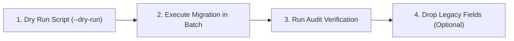

# 🚀 FQuiz — Hướng dẫn Triển khai & Vận hành (Deployment & Operations)

Tài liệu hướng dẫn triển khai nền tảng **FQuiz** lên môi trường Production (Vercel & MongoDB Atlas), thiết lập biến môi trường, quản lý cơ sở dữ liệu và quy trình di chuyển dữ liệu (Migration) không gián đoạn dịch vụ.

---

## 1. Môi trường Triển khai (Target Infrastructure)

- **Frontend & API Platform**: [Vercel](https://vercel.com) (Serverless Node.js Runtime).
- **Deployment Region**: `sin1` (Singapore) — tối ưu hóa độ trễ thấp nhất cho người dùng khu vực Đông Nam Á.
- **Database**: [MongoDB Atlas](https://www.mongodb.com/atlas) (M10+ Cluster khuyến nghị cho Production).

---

## 2. Danh mục Biến Môi trường (Environment Variables Checklist)

File `.env.local` mẫu dành cho phát triển cục bộ và cấu hình trên Vercel Dashboard:

```ini
# ==============================================================================
# 🗄️ DATABASE (MongoDB Atlas)
# ==============================================================================
# Connection string chuẩn MongoDB SRV hoặc direct URI
MONGODB_URI=mongodb+srv://<username>:<password>@cluster.mongodb.net/fquiz?retryWrites=true&w=majority

# ==============================================================================
# 🔐 AUTHENTICATION & SECURITY (JWT)
# ==============================================================================
# Khóa ký JWT hiện tại (Bắt buộc >= 32 ký tự ngẫu nhiên)
JWT_SECRET=super_secret_jwt_key_at_least_32_characters_long_12345
# Khóa ký JWT phiên bản trước (Hỗ trợ Zero-Downtime Token Rotation)
JWT_SECRET_PREV=previous_secret_jwt_key_for_smooth_rotation_67890
# Environment
NODE_ENV=production

# ==============================================================================
# 🌐 DOMAINS & CORS
# ==============================================================================
ALLOWED_IMAGE_DOMAINS=images.unsplash.com,lh3.googleusercontent.com,fquiz-web.vercel.app
APP_URL=https://fquiz-web.vercel.app
CORS_ALLOWED_ORIGINS=https://fquiz-web.vercel.app

# ==============================================================================
# 🧠 AI PROVIDERS (Gemini & OpenAI)
# ==============================================================================
GEMINI_API_KEY=AIzaSyYourGeminiApiKeyHere
OPENAI_API_KEY=sk-proj-YourOpenAIApiKeyHere

# ==============================================================================
# 📧 EMAIL SERVICE (Nodemailer SMTP)
# ==============================================================================
MAIL_HOST=smtp.gmail.com
MAIL_PORT=587
MAIL_USER=no-reply@fquiz.com
MAIL_APP_PASSWORD=your_gmail_app_password
MAIL_FROM="FQuiz Support" <no-reply@fquiz.com>

# ==============================================================================
# ⏱️ CRON JOBS & MAINTENANCE
# ==============================================================================
CRON_SECRET=your-cron-secret-key

# ==============================================================================
# 📊 LOGGING & MONITORING
# ==============================================================================
LOG_LEVEL=info
```

---

## 3. Quy trình Triển khai Lên Vercel (Deployment Steps)

### 3.1. Triển khai Tự động qua Git (Recommended)
Dự án được cấu hình tự động triển khai thông qua Vercel GitHub Integration:
1. Mọi commit được push hoặc merge vào branch `main` sẽ kích hoạt **Production Deployment**.
2. Mọi Pull Request vào `develop` hoặc `main` sẽ kích hoạt **Preview Deployment** độc lập để kiểm thử.

### 3.2. Triển khai Thủ công qua Vercel CLI
```bash
# 1. Cài đặt Vercel CLI
npm install -g vercel

# 2. Đăng nhập và liên kết dự án
vercel login
vercel link

# 3. Build và Deploy Production
npm run build
vercel deploy --prod
```

---

## 4. Quản lý Cơ sở Dữ liệu & Migration (Zero-Downtime)

Để nâng cấp schema cơ sở dữ liệu mà không làm gián đoạn người dùng đang làm bài thi, FQuiz áp dụng mô hình **Double-Write / Backward-Compatible Migration**:



### Các bước thực hiện Migration an toàn:

1. **Chạy thử nghiệm (Dry-Run)** để kiểm tra số lượng bản ghi bị ảnh hưởng mà không ghi đè dữ liệu thật:
   ```bash
   npm run migrate:preserve-results:dry-run
   ```
2. **Chạy Migration chính thức**:
   ```bash
   npm run migrate:preserve-results
   ```
3. **Kiểm tra tính toàn vẹn dữ liệu** sau migration:
   ```bash
   npm run audit:quiz-codes
   npm run audit:answer-conflicts
   ```

---

## 5. Quy trình CI/CD Pipeline (`.github/workflows/ci.yml`)

Mỗi khi có code mới được đẩy lên repository, GitHub Actions Workflow sẽ tự động thực hiện chuỗi kiểm định nghiêm ngặt:

```yaml
# Các bước trong CI Pipeline
1. node .agents/scripts/verify.js --strict   # Kiểm định 9 quy tắc AI Governance
2. npm ci                                  # Cài đặt chính xác các phụ thuộc
3. npm run lint                            # Quét lỗi cú pháp, typing & security ESLint
4. npm test                                # Chạy toàn bộ test suites Jest
5. npm run build                           # Biên dịch Next.js production & type-check
```
