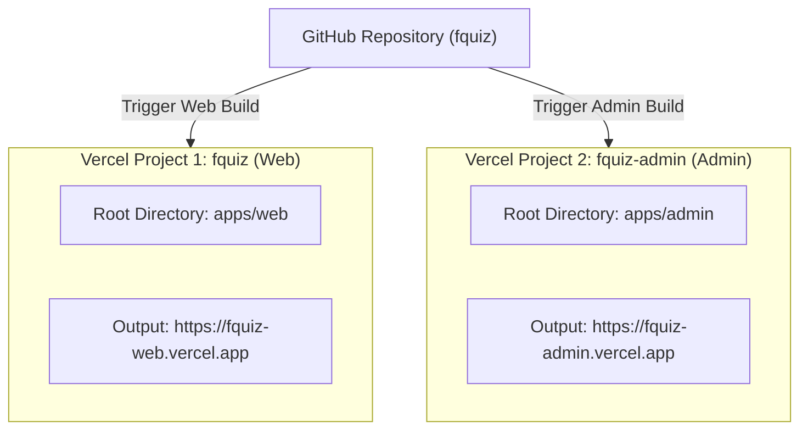
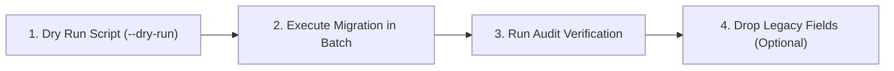

# 🚀 FQuiz — Hướng Dẫn Triển Khai & Vận Hành Monorepo (Deployment & Operations Guide)

Tài liệu đặc tả toàn diện quy trình triển khai, cấu hình hạ tầng trên **Vercel** (Turborepo Monorepo với 2 Vercel Projects độc lập) và **MongoDB Atlas**, thiết lập biến môi trường, quản lý cơ sở dữ liệu, tối ưu hóa hiệu năng và quy trình di chuyển dữ liệu (Migration) không gián đoạn dịch vụ của nền tảng **FQuiz**.

---

## 1. Cấu Trúc Monorepo & Workspaces

FQuiz được tổ chức theo kiến trúc **Pure Symmetrical Turborepo Monorepo** với 2 ứng dụng thực thi và 5 packages dùng chung:

```
fquiz/
├── apps/
│   ├── web/                            # 🎓 Web Học Viên, Giáo Viên & Diễn Đàn (Port 3000 / fquiz-web.vercel.app)
│   │   ├── app/                        # Next.js 16 App Router ((auth), (student), (teacher), quiz, community, explore, api)
│   │   ├── components/                 # Web UI Components (Quiz, Classroom, Community, AI Assistant)
│   │   ├── hooks/                      # Web Custom React Hooks
│   │   ├── store/                      # Zustand State Store (quiz-session, toast)
│   │   ├── lib/                        # Web Services & Feature Modules (AIContentService, QuizEngine)
│   │   ├── proxy.ts                    # Web Edge Proxy Middleware (Redirect /admin, Security Headers)
│   │   ├── next.config.js              # Next.js 16 Web Config (Transpile packages, Turbopack)
│   │   ├── tailwind.config.ts          # Tailwind CSS (kế thừa preset @fquiz/ui)
│   │   ├── vercel.json                 # Cấu hình Vercel Web Cron & region sin1
│   │   └── package.json                # name: "@fquiz/web"
│   │
│   └── admin/                          # 🛡️ Cổng Quản Trị Hệ Thống (Port 3001 / fquiz-admin.vercel.app)
│       ├── app/                        # Next.js 16 App Router (Slim Orchestrator Pages <90 lines)
│       │   ├── (dashboard)/            # Categories, Feedback, Question-bank, Quizzes, Settings, Users
│       │   ├── login/                  # Trang đăng nhập Admin riêng biệt
│       │   └── api/                    # Admin REST APIs (Quizzes, Users, Question Bank, Settings)
│       ├── components/                 # Admin UI Components & Subcomponents (Tách lớp độc lập)
│       ├── hooks/                      # Custom Hooks Layer (State, API Mutations & Business Logic)
│       ├── proxy.ts                    # Zero-Trust Admin Proxy Middleware (Node.js runtime)
│       ├── next.config.js              # Next.js 16 Admin Config
│       ├── tailwind.config.ts          # Tailwind CSS (kế thừa preset @fquiz/ui)
│       ├── vercel.json                 # Cấu hình region sin1 cho Vercel Admin
│       └── package.json                # name: "@fquiz/admin"
│
├── packages/
│   ├── database/                       # 🗄️ Database Singleton & Connection Pool (@fquiz/database)
│   ├── models/                         # 📦 Single Source of Truth Mongoose Schemas & Types (@fquiz/models)
│   ├── auth/                           # 🔐 Security, JWT Rotation, CSRF & RBAC (@fquiz/auth)
│   ├── ui/                             # 🎨 Shared UI Primitives, 3-Tier Tokens & GSAP (@fquiz/ui)
│   └── config-typescript/              # ⚙️ Shared TypeScript Configs (@fquiz/config-typescript)
│
├── e2e/                                # 🧪 Playwright E2E Multi-Server Test Suite (57 Tests)
├── .agents/                            # 🤖 AI Agent Governance & CI/CD Verification Engine
├── turbo.json                          # ⚡ Turborepo Task Pipeline & Remote Caching
└── package.json                        # 📦 Monorepo Root Package
```

---

## 2. Thiết Lập 2 Vercel Projects Độc Lập

Hệ thống triển khai **2 Vercel Projects riêng biệt** kết nối chung vào cùng 1 GitHub Repository:



### 2.1. Project 1: `fquiz` (Web Học sinh & Giáo viên)

* **Thiết lập trên Vercel Dashboard**:
  * **Project Name**: `fquiz` (hoặc `fquiz-web`)
  * **Framework Preset**: `Next.js`
  * **Root Directory**: `apps/web`
  * **Include source files outside of the Root Directory in the Build Step**: **BẬT (Checked)** *(Bắt buộc để Vercel nhận diện root `node_modules` và packages dùng chung)*.
  * **Build Command**: `npm run build`
  * **Output Directory**: `.next`
  * **Install Command**: `npm install`
  * **Ignored Build Step** (*Project Settings* → *Git*):
    ```bash
    npx turbo-ignore
    ```

* **Deploy thủ công bằng Vercel CLI**:
  ```bash
  cd apps/web
  npx vercel link --project fquiz --yes --scope nvtruongops
  npx vercel --prod --yes
  ```

---

### 2.2. Project 2: `fquiz-admin` (Cổng Quản trị viên)

* **Thiết lập trên Vercel Dashboard**:
  * **Project Name**: `fquiz-admin`
  * **Framework Preset**: `Next.js`
  * **Root Directory**: `apps/admin`
  * **Include source files outside of the Root Directory in the Build Step**: **BẬT (Checked)** *(Bắt buộc để Vercel nhận diện root `node_modules` và packages dùng chung)*.
  * **Build Command**: `npm run build`
  * **Output Directory**: `.next`
  * **Install Command**: `npm install`
  * **Ignored Build Step** (*Project Settings* → *Git*):
    ```bash
    npx turbo-ignore
    ```

* **Deploy thủ công bằng Vercel CLI**:
  ```bash
  cd apps/admin
  npx vercel link --project fquiz-admin --yes --scope nvtruongops
  npx vercel --prod --yes
  ```

---

## 3. Bảng Biến Môi Trường Cấu Hình Trên Vercel

Cả 2 project Vercel cần được cấu hình các biến môi trường sau trong **Project Settings** → **Environment Variables**:

### 3.1. Biến bắt buộc cốt lõi (Core Mandatory)

| Biến môi trường | Web (`fquiz`) | Admin (`fquiz-admin`) | Mô tả & Lưu ý |
|---|:---:|:---:|---|
| `MONGODB_URI` | ✅ | ✅ | Connection string MongoDB Atlas chung (e.g. `mongodb+srv://...`). |
| `JWT_SECRET` | ✅ | ✅ | **BẮT BUỘC GIỐNG NHAU 100%** (Tối thiểu 32 ký tự / 64 hex) để chia sẻ session & xác thực cross-app. |
| `JWT_SECRET_PREV` | ✅ | ✅ | Khóa bí mật cũ khi xoay tua JWT (Zero-Downtime Key Rotation). |
| `APP_URL` | `https://fquiz-web.vercel.app` | `https://fquiz-admin.vercel.app` | URL chính thức của từng ứng dụng. |
| `CORS_ALLOWED_ORIGINS` | `https://fquiz-web.vercel.app,https://fquiz-admin.vercel.app` | `https://fquiz-web.vercel.app,https://fquiz-admin.vercel.app` | Danh sách domain được phép gọi API cross-origin trong `proxy.ts`. |
| `NEXT_PUBLIC_ADMIN_URL` | `https://fquiz-admin.vercel.app/login` | — | Link điều hướng đến Cổng Quản trị trên Web `/login`. |

### 3.2. Bảo mật, Cron Jobs & AI Providers

| Biến môi trường | Web (`fquiz`) | Admin (`fquiz-admin`) | Mô tả & Lưu ý |
|---|:---:|:---:|---|
| `CRON_SECRET` | ✅ | — | Khóa xác thực Vercel Cron Job tự động dọn dẹp tài khoản xóa (`/api/jobs/cleanup-deleted-accounts`). |
| `ENCRYPTION_KEY` | ✅ | ✅ | Chuỗi 32-byte hex dùng cho thuật toán AES-256-GCM mã hóa các LLM Provider API Keys lưu trong database. |
| `GEMINI_API_KEY` | ✅ | ✅ | Google Gemini AI API key mặc định cho Question Bank và AI Quiz Assistant. |
| `OPENAI_API_KEY` | ✅ | ✅ | (Tùy chọn) OpenAI API Key hoặc custom provider. |
| `OPENAI_BASE_URL` | ✅ | ✅ | (Tùy chọn) Base URL cho OpenAI compatible provider. |
| `OPENAI_MODEL` | ✅ | ✅ | (Tùy chọn) Model name AI. |
| `LOG_LEVEL` | `info` | `info` | Mức log của Pino Logger (`info` trên production, `debug` ở dev). |

### 3.3. Dịch vụ Email & OAuth (Dành cho Web)

| Biến môi trường | Web (`fquiz`) | Admin (`fquiz-admin`) | Mô tả & Lưu ý |
|---|:---:|:---:|---|
| `MAIL_HOST` / `MAIL_PORT` | ✅ | — | Máy chủ SMTP (e.g. `smtp.gmail.com`, port `587`). |
| `MAIL_USER` / `MAIL_APP_PASSWORD` | ✅ | — | Thông tin tài khoản gửi mail OTP & khôi phục mật khẩu. |
| `MAIL_FROM` | ✅ | — | Tên người gửi hiển thị (e.g. `"FQuiz Support <no-reply@fquiz.com>"`). |
| `NEXT_PUBLIC_GOOGLE_CLIENT_ID` | ✅ | — | Google OAuth Client ID cho tính năng Đăng nhập bằng Google. |
| `GOOGLE_CLIENT_SECRET` | ✅ | — | Google OAuth Client Secret. |
| `ALLOWED_IMAGE_DOMAINS` | ✅ | — | Danh sách hostname ảnh ngoài được phép tải (ngăn cách bởi dấu phẩy). |

---

## 4. Tối Ưu Hóa Hạ Tầng Vercel & Hiệu Năng

1. **Vercel Serverless Regions (`sin1`)**:
   - Cả 2 file `apps/web/vercel.json` và `apps/admin/vercel.json` đều được ghim tại region **`sin1` (Singapore)** nhằm đạt độ trễ tối thiểu (< 40ms) đối với người dùng và kết nối MongoDB Atlas khu vực Đông Nam Á.

2. **Tối ưu hóa Code Splitting & Dynamic Imports**:
   - Áp dụng `next/dynamic` với `ssr: false` cho toàn bộ các mô-đun quản trị nặng trong `apps/admin/app/(dashboard)/question-bank/page.tsx`.
   - Giảm dung lượng JavaScript bundle tải ban đầu, ngăn chặn việc load mã code của các tính năng nâng cao khi người dùng chỉ duyệt trạng thái cơ bản.

3. **Vercel Cron Jobs (Tự động dọn dẹp dữ liệu)**:
   - `apps/web/vercel.json` cấu hình lịch chạy hằng ngày lúc 02:00 UTC:
     ```json
     "crons": [
       {
         "path": "/api/jobs/cleanup-deleted-accounts",
         "schedule": "0 2 * * *"
       }
     ]
     ```
   - API Route `/api/jobs/cleanup-deleted-accounts` kiểm tra header `Authorization: Bearer <CRON_SECRET>` để tự động xóa vĩnh viễn các tài khoản đã yêu cầu xóa quá 72 giờ (quy định GDPR/Privacy).

4. **Cơ chế Chống Dò Quét Tài Khoản (Anti-Enumeration) & Zero-Trust**:
   - Web Login (`/login`) luôn phản hồi thông điệp trung tính khi sai thông tin.
   - Khi tài khoản có role `admin` đăng nhập thành công tại Web, hệ thống tự động chuyển tiếp an toàn sang `NEXT_PUBLIC_ADMIN_URL` (`https://fquiz-admin.vercel.app/login`).
   - Admin Proxy (`apps/admin/proxy.ts`) hoạt động theo nguyên tắc Zero-Trust, từ chối mọi request thiếu quyền `admin`/`dev` trước khi request chạm vào Server Component hay API Route.

5. **Bảo mật Header (CSP, HSTS & Permissions Policy)**:
   - `apps/web/next.config.js` và `apps/admin/next.config.js` đã tích hợp đầy đủ: Content Security Policy (CSP), `X-Frame-Options: DENY`, `X-Content-Type-Options: nosniff`, `Strict-Transport-Security` (HSTS), `Permissions-Policy`.

---

## 5. Quản Lý Cơ Sở Dữ Liệu & Migration (Zero-Downtime)

Để nâng cấp schema cơ sở dữ liệu mà không làm gián đoạn người dùng đang làm bài thi, FQuiz áp dụng mô hình **Double-Write / Backward-Compatible Migration**:



### Các bước thực hiện Migration an toàn:

1. **Chạy thử nghiệm (Dry-Run)** để kiểm tra số lượng bản ghi bị ảnh hưởng mà không ghi đè dữ liệu thật:
   ```bash
   npm run migrate:preserve-results:dry-run
   ```
2. **Chạy Migration chính thức**:
   ```bash
   npm run migrate:preserve-results
   ```
3. **Kiểm tra tính toàn vẹn dữ liệu** sau migration:
   ```bash
   npm run audit:quiz-codes
   npm run audit:answer-conflicts
   ```

---

## 6. Các Lệnh Vận Hành & Kiểm Thử (Cheatsheet)

| Lệnh | Mô tả tác vụ |
|---|---|
| `npm run dev` | Khởi chạy song song cả Web (`:3000`) và Admin (`:3001`) qua Turborepo |
| `npm run dev:web` | Khởi chạy riêng Web học viên (`http://localhost:3000`) |
| `npm run dev:admin` | Khởi chạy riêng Admin Portal (`http://localhost:3001`) |
| `npm run build` | Build production toàn bộ Monorepo (`apps/web` + `apps/admin`) |
| `npm run build:web` | Build production riêng Web học viên |
| `npm run build:admin` | Build production riêng Admin Portal |
| `npm run lint` | Kiểm tra ESLint toàn bộ Monorepo |
| `npm run check-types` | Kiểm tra TypeScript toàn bộ 7 workspaces |
| `npm test` | Chạy toàn bộ Jest Unit & Integration Tests (66 test suites, 430 tests) |
| `npx playwright test` | Chạy toàn bộ E2E Tests (Multi-server `:3000` & `:3001`) |
| `node .agents/scripts/verify.js --strict` | Chạy bộ Rule Engine Governance kiểm tra nghiêm ngặt 18 quy tắc |

---

## 7. Pre-Deployment & Post-Deployment Checklist

### 📋 Pre-Deployment (Trước khi deploy)
- [x] Chạy `npm run lint` (0 lỗi ESLint).
- [x] Chạy `npm run check-types` (0 lỗi TypeScript trên 7 workspaces).
- [x] Chạy `npm run build` (Build thành công cả 2 ứng dụng Web & Admin).
- [x] Chạy `npm test` (66/66 suites, 430/430 tests pass).
- [x] Chạy `npx playwright test` (57/57 E2E tests pass).
- [x] Chạy `node .agents/scripts/verify.js --strict` (18/18 rule check pass).
- [x] Đã cấu hình đủ Environment Variables trên cả 2 Vercel Projects (đặc biệt `MONGODB_URI`, `JWT_SECRET` giống nhau, `CRON_SECRET`, `CORS_ALLOWED_ORIGINS`).

### 📋 Post-Deployment (Sau khi deploy lên Vercel)
- [x] Truy cập `https://fquiz-web.vercel.app` và `https://fquiz-admin.vercel.app` kiểm tra HTTPS & HTTP 200 OK.
- [x] Đăng nhập tài khoản Quản trị trên Web `fquiz-web` → Xác nhận chuyển hướng mượt mà sang `fquiz-admin`.
- [x] Đăng nhập trực tiếp trên `fquiz-admin` → Xác nhận truy cập Dashboard, Quizzes, Users, Categories, Question Bank.
- [x] Kiểm tra tab *Vercel Dashboard* → *Cron Jobs* xác nhận `/api/jobs/cleanup-deleted-accounts` đã được đăng ký kích hoạt.
