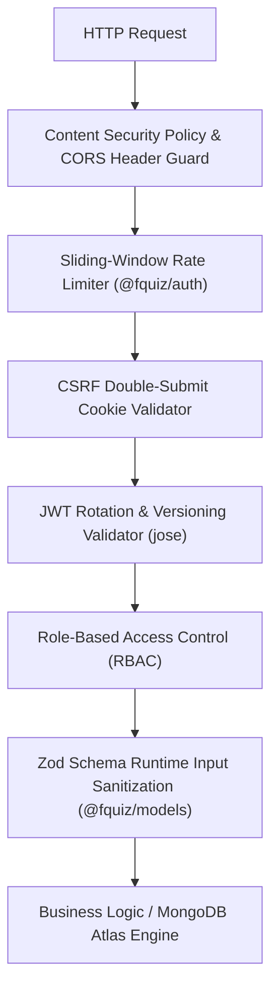

# 🛡️ FQuiz — Kiến trúc An toàn & Bảo mật (Security Architecture)

> **Phiên bản**: 2.0.0 (Pure Symmetrical Monorepo Architecture)  
> **Gói quản lý**: `@fquiz/auth` (`packages/auth`)  
> **Tiêu chuẩn**: Zero-Trust Security, Defense-in-Depth, Double-Submit CSRF, JWT Key Rotation, Sliding Window Rate Limiting.

---

## 1. Mô hình Bảo mật Tổng thể (Security Overview)

FQuiz áp dụng chiến lược **Zero-Trust**: Mọi yêu cầu từ client đều được coi là không đáng tin cậy cho đến khi được kiểm chứng qua Edge Proxies, cơ chế xác thực token đa tầng từ `@fquiz/auth`, bảo vệ CSRF và validate chặt chẽ bằng Zod Schemas từ `@fquiz/models`.

---

## 2. Các Cơ chế Bảo mật Trọng yếu

### 2.1. Xác thực JWT & Cơ chế Xoay vòng Khóa (Token Rotation)
- Hệ thống sử dụng thư viện `jose` để mã hóa và giải mã JWT trên môi trường Node.js qua `@fquiz/auth`.
- **Hỗ trợ Zero-Downtime Key Rotation**:
  - `JWT_SECRET`: Khóa bí mật chính đang sử dụng để ký token mới.
  - `JWT_SECRET_PREV`: Khóa bí mật cũ được giữ lại trong giai đoạn chuyển tiếp để xác thực các token đã cấp trước đó.
  - Khi đổi khóa, hệ thống thử xác thực với `JWT_SECRET`; nếu thất bại sẽ fallback về `JWT_SECRET_PREV` trước khi từ chối.
- **Token Versioning & Vô hiệu hóa Tức thì**:
  - Trường `token_version` được lưu trong document `User` và được bọc trong payload của JWT.
  - Khi người dùng đổi mật khẩu hoặc bị Quản trị viên khóa tài khoản (Ban), `token_version` trong database sẽ tự động tăng lên 1 đơn vị.
  - Mọi phiên đăng nhập hiện hữu trên các thiết bị khác sẽ ngay lập tức bị từ chối truy cập (401 Unauthorized) mà không cần duy trì blacklist cồng kềnh.

---

### 2.2. Phòng chống Tấn công CSRF (Double-Submit Cookie Pattern)
- FQuiz áp dụng mô hình **Double-Submit Cookie**:
  1. Khi người dùng truy cập, server gán cookie `csrf-token` (cờ `httpOnly: false`, `sameSite: strict`, `secure: true` trên production).
  2. Mọi mutation request (`POST`, `PUT`, `PATCH`, `DELETE`) từ client phải đọc giá trị từ cookie này và gửi kèm trong HTTP Header `x-csrf-token`.
  3. Edge Proxies (`apps/web/proxy.ts` và `apps/admin/proxy.ts`) đối chiếu giá trị header và cookie; nếu không khớp hoặc thiếu sẽ trả về lỗi `403 Forbidden`.
- **Ngoại lệ an toàn (Exemptions)**: Các endpoint công khai không phụ thuộc trạng thái phiên hoặc các cron endpoint được bảo vệ bằng secret key.

---

### 2.3. Giới hạn Tần suất Truy cập (Sliding Window Rate Limiting)
- Package `@fquiz/auth` cung cấp bộ đếm giới hạn tần suất gọi API dựa trên địa chỉ IP / User ID.
- Sử dụng thuật toán **Sliding Window** để ngăn chặn tấn công từ chối dịch vụ (DoS), brute-force mật khẩu hoặc lạm dụng API sinh nội dung AI tốn kém chi phí.
- Phản hồi mã `429 Too Many Requests` kèm theo các header tiêu chuẩn: `Retry-After`, `X-RateLimit-Limit`, `X-RateLimit-Remaining`.

---

### 2.4. Chính sách Bảo vệ Trình duyệt (Content Security Policy - CSP)
- Được cấu hình chặt chẽ tại `apps/web/next.config.js`, `apps/admin/next.config.js` và `proxy.ts`:
  - `default-src 'self'`: Chỉ cho phép tải tài nguyên từ chính domain.
  - `script-src`: Chặn `unsafe-eval` và script từ bên thứ ba không xác thực.
  - `img-src`: Chỉ cho phép domain nội bộ và các image domains được cấu hình qua `ALLOWED_IMAGE_DOMAINS`.
  - `connect-src`: Giới hạn kết nối đến API và Google OAuth endpoints.

---

### 2.5. Edge Proxies & Phân Quyền Đa Tầng (RBAC)
- `apps/web/proxy.ts`: Cách ly hoàn toàn các routes quản trị trên Web client, redirect `/admin` sang `NEXT_PUBLIC_ADMIN_URL` (`fquiz-admin.vercel.app`), trả về `404 Not Found` cho `/api/admin/*`.
- `apps/admin/proxy.ts`: Zero-Trust RBAC Proxy từ chối mọi truy cập không có quyền `admin`/`dev` với mã lỗi `403 Forbidden`.
- HOF `withAuth`: Bảo vệ tất cả API Route Handlers với phân quyền role hierarchy rõ ràng (`student` < `teacher` < `admin` < `dev`).
