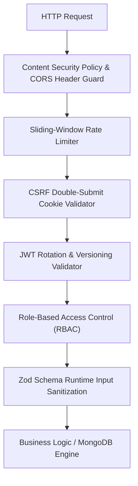

# 🛡️ FQuiz — Kiến trúc An toàn & Bảo mật (Security Architecture)

Tài liệu chi tiết về mô hình bảo vệ nhiều lớp (**Defense-in-Depth**), các giải pháp an ninh mạng, cơ chế xác thực, phòng chống tấn công và quy chuẩn mã hóa áp dụng trên toàn bộ hệ thống **FQuiz**.

---

## 1. Mô hình Bảo mật Tổng thể (Security Overview)

FQuiz áp dụng chiến lược **Zero-Trust**: Mọi yêu cầu từ client đều được coi là không đáng tin cậy cho đến khi được kiểm chứng qua Middleware, cơ chế xác thực token đa tầng, bảo vệ CSRF và validate chặt chẽ bằng Zod Schema.



---

## 2. Các Cơ chế Bảo mật Trọng yếu

### 2.1. Xác thực JWT & Cơ chế Xoay vòng Khóa (Token Rotation)
- Hệ thống sử dụng thư viện `jose` để mã hóa và giải mã JWT trên môi trường Node.js.
- **Hỗ trợ Zero-Downtime Key Rotation**:
  - `JWT_SECRET`: Khóa bí mật chính đang sử dụng để ký token mới.
  - `JWT_SECRET_PREV`: Khóa bí mật cũ được giữ lại trong giai đoạn chuyển tiếp để xác thực các token đã cấp trước đó.
  - Khi đổi khóa, hệ thống thử xác thực với `JWT_SECRET`; nếu thất bại sẽ fallback về `JWT_SECRET_PREV` trước khi từ chối.
- **Token Versioning & Vô hiệu hóa Tức thì**:
  - Trường `token_version` được lưu trong document `User` và được bọc trong payload của JWT.
  - Khi người dùng đổi mật khẩu hoặc bị Quản trị viên khóa tài khoản (Ban), `token_version` trong database sẽ tự động tăng lên 1 đơn vị.
  - Mọi phiên đăng nhập hiện hữu trên các thiết bị khác sẽ ngay lập tức bị từ chối truy cập (401 Unauthorized) mà không cần duy trì blacklist cồng kềnh.

---

### 2.2. Phòng chống Tấn công CSRF (Double-Submit Cookie Pattern)
- FQuiz áp dụng mô hình **Double-Submit Cookie**:
  1. Khi người dùng truy cập, server gán cookie `csrf-token` (cờ `httpOnly: false`, `sameSite: strict`, `secure: true` trên production).
  2. Mọi mutation request (`POST`, `PUT`, `PATCH`, `DELETE`) từ client phải đọc giá trị từ cookie này và gửi kèm trong HTTP Header `x-csrf-token`.
  3. Middleware `proxy.ts` đối chiếu giá trị header và cookie; nếu không khớp hoặc thiếu sẽ trả về lỗi `403 Forbidden`.
- **Ngoại lệ an toàn (Exemptions)**: Các endpoint công khai không phụ thuộc trạng thái phiên hoặc các cron endpoint được bảo vệ bằng secret key.

---

### 2.3. Giới hạn Tần suất Truy cập (Sliding Window Rate Limiting)
- Tầng hạ tầng `lib/core/security/rate-limit/` cung cấp bộ đếm giới hạn tần suất gọi API dựa trên địa chỉ IP / User ID.
- Sử dụng thuật toán **Sliding Window** để ngăn chặn tấn công từ chối dịch vụ (DoS), brute-force mật khẩu hoặc lạm dụng API sinh nội dung AI tốn kém chi phí.
- Phản hồi mã `429 Too Many Requests` kèm theo các header tiêu chuẩn: `Retry-After`, `X-RateLimit-Limit`, `X-RateLimit-Remaining`.

---

### 2.4. Chính sách Bảo vệ Trình duyệt (Content Security Policy - CSP)
- Được cấu hình chặt chẽ tại `next.config.js` và `proxy.ts`:
  - `default-src 'self'`: Chỉ cho phép tải tài nguyên từ chính domain.
  - `script-src`: Chặn `unsafe-eval` và script từ bên thứ ba không xác thực.
  - `img-src`: Chỉ cho phép domain nội bộ và các image domains được cấu hình qua `ALLOWED_IMAGE_DOMAINS`.
  - `connect-src`: Giới hạn kết nối đến API và Google OAuth endpoints.
  - Báo cáo vi phạm CSP được gửi tự động về `/api/security/csp-report`.

---

### 2.5. Kiểm soát Dữ liệu Đầu vào & Chống Injection
- **Zod Runtime Validation**: 100% dữ liệu đầu vào của tất cả API routes đều được validate và strip các trường không hợp lệ thông qua Zod Schemas (`lib/core/schemas/` và `lib/modules/*/schemas/`).
- **MongoDB NoSQL Injection**: Sử dụng Mongoose ODM với typed schemas và không bao giờ nội suy chuỗi thô (string concatenation) vào query operators.
- **AI Output Sanitization**: Toàn bộ nội dung trả về từ Gemini / OpenAI API đều bắt buộc phải vượt qua Zod schema validation trước khi được lưu vào cơ sở dữ liệu hoặc hiển thị lên giao diện người dùng.

---

### 2.6. Mã hóa & Quản lý Bí mật
- Mật khẩu người dùng được băm an toàn bằng **bcryptjs** với salt cost factor là `10`.
- Mã xác thực OTP (6 chữ số) được băm một chiều trước khi lưu vào MongoDB (`EmailVerification` collection).
- Tuyệt đối không hardcode API keys, credentials hay connection strings trong mã nguồn (được kiểm định tự động bởi quy tắc `CODE_QUALITY_SECURITY`).

---

### 2.7. Ghi Log An toàn & Kiểm toán (Audit Logging)
- Sử dụng **Pino Structured Logger** (`lib/core/utils/logger.ts`).
- Tự động che giấu (redact) các trường dữ liệu nhạy cảm trước khi ghi ra stdout/file:
  - `password`, `new_password`, `token`, `auth-token`, `cookie`, `authorization`, `email`, `otp`.
- Bộ sưu tập `LoginLog` ghi nhận lịch sử đăng nhập: thời gian, IP, User Agent, và trạng thái thành công/thất bại để phát hiện các hành vi bất thường.

---

## 3. Quy trình Kiểm thử & Quét Lỗ hổng Tự động

1. **Rule Engine Pre-Push Security Check**:
   ```bash
   node .agents/scripts/verify.js --strict --rule=CODE_QUALITY_SECURITY
   ```
2. **ESLint Security Plugin**:
   ```bash
   npm run lint
   ```
3. **Snyk Vulnerability Scanning**:
   ```bash
   scripts/scan-snyk.bat
   ```
