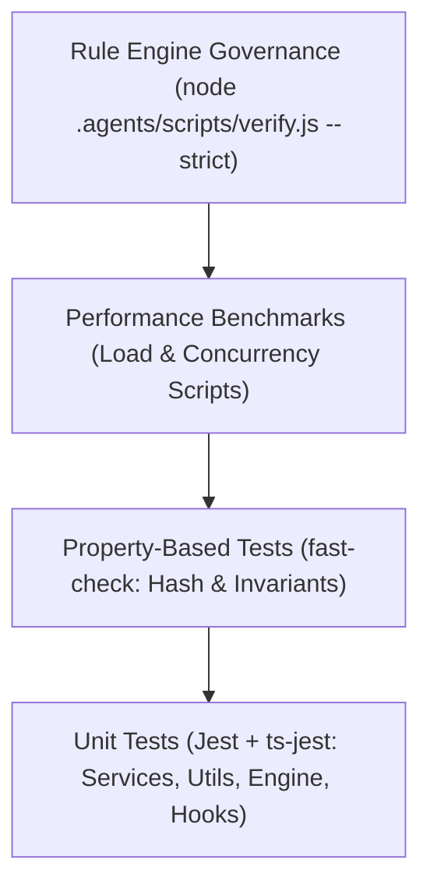

# 🧪 FQuiz — Chiến lược & Quy chuẩn Kiểm thử (Testing Strategy)

Tài liệu hướng dẫn quy chuẩn kiểm thử (Testing Guidelines), tổ chức mã test, các kỹ thuật mock, kiểm thử hiệu năng và cơ chế kiểm soát chất lượng mã nguồn bằng **AI Agent Rule Engine** của dự án **FQuiz**.

---

## 1. Kim tự tháp Kiểm thử (Testing Pyramid)



---

## 2. Cấu hình & Môi trường Kiểm thử (Test Setup)

- **Test Runner**: `Jest` kết hợp với `ts-jest` biên dịch TypeScript trực tiếp.
- **Môi trường (Environment)**: `node` (không sử dụng `jsdom` nặng nề nhằm tăng tối đa tốc độ thực thi cho các kiểm thử logic và API).
- **File cấu hình**:
  - `jest.config.ts`: Cấu hình path aliases (`@/*` $\rightarrow$ `<rootDir>/*`), whitelist module ESM (`jose`), thư mục loại trừ khỏi coverage.
  - `jest.setup.ts`: Thiết lập các biến môi trường giả lập (`JWT_SECRET`, `MONGODB_URI`, `NODE_ENV=test`).
- **Quy tắc đặt tên file test**: `**/__tests__/**/*.test.{ts,tsx}`.

---

## 3. Các Lệnh Thực thi Test (Test Commands)

```bash
# 1. Chạy toàn bộ Unit Tests
npm test

# 2. Chạy test và xuất báo cáo độ bao phủ (Coverage Report)
npm run test:coverage

# 3. Chạy test ở chế độ theo dõi (Watch Mode)
npx jest --watch

# 4. Chạy một file test cụ thể
npx jest lib/modules/quiz/__tests__/quiz-engine.test.ts

# 5. Chạy test theo pattern tên hàm/bài test
npx jest -t "atomic session completion"
```

---

## 4. Quy chuẩn Mock Dữ liệu (Mocking Standards)

Để đảm bảo các bài test chạy độc lập, nhanh chóng và không phụ thuộc vào kết nối mạng bên ngoài, dự án áp dụng các chuẩn mock sau:

### 4.1. Mock Kết nối Cơ sở Dữ liệu
```typescript
// Luôn mock mongodb connection trước khi test các services/handlers
jest.mock('@/lib/core/db/mongodb', () => ({
  connectDB: jest.fn().mockResolvedValue(true)
}));
```

### 4.2. Mock Next.js Server & Headers
```typescript
jest.mock('next/server', () => ({
  NextResponse: {
    json: jest.fn((data, init) => ({
      status: init?.status || 200,
      json: async () => data
    }))
  }
}));
```

### 4.3. Mock withAuth HOF
```typescript
jest.mock('@/lib/modules/auth/with-auth', () => ({
  withAuth: (handler: any) => (req: any, ctx: any) =>
    handler(req, {
      ...ctx,
      payload: { userId: 'mock-user-id', role: 'student' }
    })
}));
```

---

## 5. Kiểm thử Dựa trên Thuộc tính (Property-Based Testing)

Hệ thống sử dụng thư viện `fast-check` để kiểm tra các bất biến (invariants) thuật toán băm và sinh ID câu hỏi:

- **Question ID Generator Invariant**: Đảm bảo rằng dù thứ tự các lựa chọn trong mảng `options` bị đảo lộn, hàm `generateQuestionId(text, options)` luôn trả về một hash SHA-256 duy nhất và nhất quán.
- **Fingerprint Invariant**: Đảm bảo hai câu hỏi có cùng nội dung, cùng đáp án đúng, cùng chủ đề và thể loại luôn có cùng fingerprint.

---

## 6. Kiểm thử Hiệu năng & Tải (Performance Benchmarks)

Các script đo lường tải và độ trễ được đặt trong thư mục `scripts/`:

| Lệnh | File script | Mục tiêu đo lường |
|---|---|---|
| `npm run test:performance` | `scripts/test-quiz-performance.ts` | Tốc độ xử lý toàn bộ vòng đời bài thi |
| `npm run test:mongodb` | `scripts/test-mongodb-performance.ts` | Độ trễ truy vấn và indexing trên MongoDB |
| `npm run test:session-perf` | `scripts/test-session-start-perf.ts` | Thời gian khởi tạo phiên thi và cache snapshot |
| `npm run test:answer-perf` | `scripts/test-answer-perf.ts` | Tốc độ chấm điểm câu trả lời dưới tải lớn |

---

## 7. Kiểm soát Chất lượng Bằng AI Agent Rule Engine

Dự án trang bị bộ công cụ kiểm định tự động chạy trước mỗi đợt commit và trong GitHub Actions CI (`.github/workflows/ci.yml`):

```bash
# Kiểm tra toàn bộ 9 quy tắc quản trị hệ thống ở chế độ nghiêm ngặt
node .agents/scripts/verify.js --strict
```

### 9 Quy tắc Quản trị Bắt buộc:
1. `BUILD_TYPE_CHECK`: 100% pass TypeScript compilation (0 error).
2. `CODE_QUALITY_SECURITY`: 0 hardcoded secrets, 0 security vulnerabilities.
3. `CROSS_MODULE_BOUNDARY`: 0 cross-module model import, 0 Mongoose `.populate()`.
4. `ESLINT_VALIDATION`: 100% pass ESLint & SonarJS code quality rules.
5. `FOLDER_STRUCTURE`: Đảm bảo đầy đủ 7 thư mục kiến trúc chuẩn.
6. `LINT_ISSUES`: 0 biến không dùng, 0 swallowed errors, 0 explicit `any`.
7. `NO_MOCK_DATA`: 0 dữ liệu mock tĩnh trong code production.
8. `SKILLS_GOVERNANCE`: Đảm bảo tính toàn vẹn của các Agent Skills trong `.agents/skills/`.
9. `THEME_GOVERNANCE`: Đảm bảo 3-Tier Design Tokens và độ tương phản WCAG 2.2 AA.
