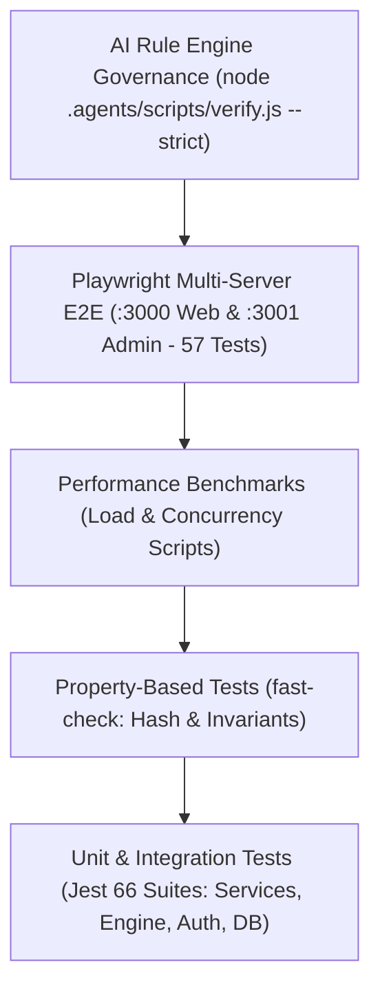

# 🧪 FQuiz — Chiến lược & Quy chuẩn Kiểm thử (Testing Strategy)

Tài liệu hướng dẫn quy chuẩn kiểm thử (Testing Guidelines), tổ chức mã test, các kỹ thuật mock, kiểm thử hiệu năng và cơ chế kiểm soát chất lượng mã nguồn bằng **AI Agent Rule Engine** của dự án **FQuiz**.

---

## 1. Kim tự tháp Kiểm thử (Testing Pyramid)



---

## 2. Cấu hình & Môi trường Kiểm thử (Test Setup)

- **Unit & Integration Runner**: `Jest` kết hợp với `ts-jest` biên dịch TypeScript trực tiếp trên môi trường Node.js.
- **Path Mapping (`jest.config.ts`)**:
  - `^@/(.*)$`: `<rootDir>/apps/web/$1`
  - `^@fquiz/database$`: `<rootDir>/packages/database/src`
  - `^@fquiz/models$`: `<rootDir>/packages/models/src`
  - `^@fquiz/auth$`: `<rootDir>/packages/auth/src`
  - `^@fquiz/ui$`: `<rootDir>/packages/ui/src`
- **E2E Runner**: `Playwright` điều phối song song cả 2 ứng dụng (`apps/web` trên `:3000` và `apps/admin` trên `:3001`).
- **Quy tắc đặt tên file test**: `**/__tests__/**/*.test.{ts,tsx}` hoặc `e2e/**/*.spec.ts`.

---

## 3. Các Lệnh Thực thi Test (Test Commands)

```bash
# 1. Chạy toàn bộ 66 Unit & Integration Test Suites (Jest)
npm test

# 2. Chạy test và xuất báo cáo độ bao phủ (Coverage Report)
npm run test:coverage

# 3. Chạy toàn bộ 57 E2E Tests (Playwright Multi-Server :3000 & :3001)
npx playwright test

# 4. Chạy Playwright với giao diện tương tác trực quan
npx playwright test --ui

# 5. Chạy riêng kịch bản tương tác liên ứng dụng Web & Admin
npx playwright test "e2e/cross-app-impact.spec.ts"

# 6. Kiểm tra TypeScript trên toàn bộ 7 workspaces Monorepo
npx turbo check-types

# 7. Chạy AI Rule Engine Governance kiểm tra nghiêm ngặt 18 quy tắc
node .agents/scripts/verify.js --strict
```

---

## 4. Quy chuẩn Mock Dữ liệu (Mocking Standards)

Để đảm bảo các bài test chạy độc lập, nhanh chóng và không phụ thuộc vào kết nối mạng bên ngoài:

### 4.1. Mock Kết nối Cơ sở Dữ liệu
```typescript
jest.mock('@/lib/core/db/mongodb', () => ({
  connectDB: jest.fn().mockResolvedValue(true)
}));
```

### 4.2. Mock Next.js Server & Headers
```typescript
jest.mock('next/server', () => ({
  NextResponse: {
    json: jest.fn((data, init) => ({
      status: init?.status || 200,
      json: async () => data
    }))
  }
}));
```

### 4.3. Mock withAuth HOF
```typescript
jest.mock('@/lib/modules/auth/with-auth', () => ({
  withAuth: (handler: any) => (req: any, ctx: any) =>
    handler(req, {
      ...ctx,
      payload: { userId: 'mock-user-id', role: 'student' }
    })
}));
```

---

## 5. Kiểm thử Dựa trên Thuộc tính (Property-Based Testing)

Hệ thống sử dụng thư viện `fast-check` để kiểm tra các bất biến (invariants) thuật toán băm và sinh ID câu hỏi:

- **Question ID Generator Invariant**: Đảm bảo rằng dù thứ tự các lựa chọn trong mảng `options` bị đảo lộn, hàm `generateQuestionId(text, options)` luôn trả về một hash SHA-256 duy nhất và nhất quán.
- **Fingerprint Invariant**: Đảm bảo hai câu hỏi có cùng nội dung, cùng đáp án đúng, cùng chủ đề và thể loại luôn có cùng fingerprint.

---

## 6. Kiểm soát Chất lượng Bằng AI Agent Rule Engine

Dự án trang bị bộ công cụ kiểm định tự động chạy trước mỗi đợt commit và trong GitHub Actions CI (`.github/workflows/ci.yml`):

```bash
# Kiểm tra toàn bộ quy tắc quản trị hệ thống ở chế độ nghiêm ngặt
node .agents/scripts/verify.js --strict
```

### 9 Quy tắc Quản trị Bắt buộc:
1. `BUILD_TYPE_CHECK`: 100% pass TypeScript compilation trên tất cả packages (0 error).
2. `CODE_QUALITY_SECURITY`: 0 hardcoded secrets, 0 security vulnerabilities.
3. `CROSS_MODULE_BOUNDARY`: 0 cross-module model import, 0 Mongoose `.populate()`.
4. `ESLINT_VALIDATION`: 100% pass ESLint code quality & security rules.
5. `FOLDER_STRUCTURE`: Đảm bảo cấu trúc monorepo phân tầng đầy đủ.
6. `LINT_ISSUES`: 0 biến không dùng, 0 swallowed errors, 0 explicit `any`.
7. `NO_MOCK_DATA`: 0 dữ liệu mock tĩnh trong code production.
8. `SKILLS_GOVERNANCE`: Đảm bảo tính toàn vẹn của các Agent Skills trong `.agents/skills/`.
9. `THEME_GOVERNANCE`: Đảm bảo 3-Tier Design Tokens và độ tương phản WCAG 2.2 AA.
