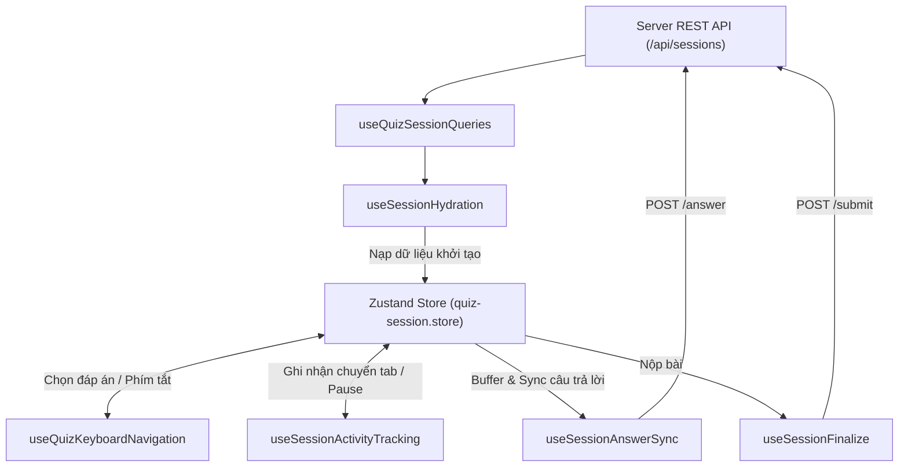

# 🪝 Custom React Hooks (`hooks/`)

Tài liệu đặc tả toàn bộ hệ thống **Custom React Hooks** của dự án **FQuiz**, bao gồm các hooks tương tác với **TanStack React Query v5**, đồng bộ **Zustand Client State**, điều phối hoạt ảnh, điều hướng bàn phím và tối ưu hóa trải nghiệm người dùng.

---

## 1. Cấu trúc Phân nhóm (Directory Structure)

```
hooks/
├── auth/
│   └── useAuth.ts                    # Hook lấy thông tin phiên đăng nhập, vai trò và quyền hạn
├── quiz/                              # Hooks chuyên biệt cho phòng thi & soạn thảo bài thi
│   ├── useAnimationPreference.ts      # Kiểm tra tùy chọn giảm chuyển động (prefers-reduced-motion)
│   ├── useFlashcardSession.ts         # Điều phối phiên học từ vựng bằng thẻ Flashcard 3D
│   ├── useMobileQuizSessionController.ts # Điều khiển phòng thi tối ưu cho màn hình cảm ứng di động
│   ├── usePinnedQuestions.ts          # Quản lý danh sách câu hỏi học sinh ghim để ôn lại
│   ├── useQuestionBankCheck.ts        # Kiểm tra trùng lặp câu hỏi với ngân hàng câu hỏi
│   ├── useQuestionBankWarning.ts      # Cảnh báo xung đột đáp án trong thời gian thực khi soạn đề
│   ├── useQuizKeyboardNavigation.ts   # Điều hướng làm bài bằng phím tắt (1-4, Mũi tên, Enter, Space)
│   ├── useQuizSessionQueries.ts       # TanStack Query hooks lấy thông tin session và câu hỏi
│   ├── useSessionActivityTracking.ts  # Theo dõi hành vi học viên: chuyển tab, pause, resume
│   ├── useSessionAnswerSync.ts        # Tự động đồng bộ câu trả lời từ Zustand Store lên Server
│   ├── useSessionFinalize.ts          # Xử lý nộp bài thi chung cuộc và điều hướng trang kết quả
│   ├── useSessionHydration.ts         # Khởi tạo và nạp dữ liệu câu hỏi từ Server vào Zustand Store
│   └── useSubmitAnswer.ts             # Mutation hook nộp câu trả lời cho từng câu hỏi
├── shared/
│   └── useDebounce.ts                 # Hook trì hoãn giá trị tìm kiếm và hàm xử lý (Debounce)
├── useAdminCategories.ts              # Quản lý danh mục bài thi cho Quản trị viên
├── useAdminSettings.ts                # Quản lý cấu hình toàn hệ thống (Bảo trì, LLM Provider)
├── useCommunityFeed.ts                # Tải bài viết, bình luận và lượt thích trên diễn đàn
├── useLogout.ts                       # Xử lý đăng xuất, xóa cookie và làm sạch bộ nhớ cache
├── useMixQuizGenerator.ts             # Khởi tạo bài thi trộn ngẫu nhiên từ nhiều bộ đề
├── useMyQuizzes.ts                    # Quản lý danh sách các đề thi do học viên tự tạo
├── useQuizEditor.ts                   # Quản lý trạng thái và tự động lưu trong bộ soạn thảo đề thi
├── useStudentClassrooms.ts            # Tải danh sách lớp học và hành động tham gia lớp của học sinh
├── useStudentDashboard.ts             # Tải chỉ số học tập, chuỗi streak và bài thi dở dang
├── useTeacherClassrooms.ts            # Quản lý danh sách lớp, thành viên và giao bài của giáo viên
└── useTeacherQuizzes.ts               # Danh sách đề thi dùng để giao bài tập của giáo viên
```

---

## 2. Luồng Điều phối Phiên Thi Trắc nghiệm (Quiz Session Data Flow)

Các hooks trong `hooks/quiz/` hoạt động phối hợp chặt chẽ theo quy trình khép kín:



---

## 3. Chi tiết Các Hooks Trọng yếu

### 3.1. `useSessionHydration` & `useSessionAnswerSync`
- **Hydration**: Khi trang làm bài được tải, hook đọc dữ liệu session và danh sách câu hỏi từ TanStack Query, sau đó nạp vào Zustand store nhằm loại bỏ độ trễ khi chuyển câu hỏi.
- **Answer Sync**: Khi học viên chọn đáp án, thay đổi được lưu ngay lập tức vào Zustand store (UI phản hồi 0ms). Hook tự động gửi request `POST /api/sessions/[id]/answer` lên server trong background và tự động retry nếu gặp sự cố mạng tạm thời.

### 3.2. `useQuizKeyboardNavigation`
Cho phép học viên làm bài thi tốc độ cao hoàn toàn bằng bàn phím máy tính:
- Phím `1`, `2`, `3`, `4`: Chọn nhanh các đáp án tương ứng A, B, C, D.
- Phím `ArrowLeft` / `ArrowRight`: Chuyển lùi / tiến giữa các câu hỏi.
- Phím `Space` / `F`: Đánh dấu cờ (Flag) câu hỏi cần xem lại.
- Phím `Enter`: Mở modal xác nhận nộp bài (khi ở câu cuối).

### 3.3. `useSessionActivityTracking`
- Lắng nghe các sự kiện trình duyệt `visibilitychange` (học sinh chuyển sang tab khác hoặc thu nhỏ trình duyệt).
- Tự động tạm dừng đồng hồ đếm giờ khi có modal hiển thị hoặc khi học sinh chủ động bấm Tạm dừng.
- Gửi báo cáo định kỳ về `/api/sessions/[id]/activity` để phục vụ giám sát tính trung thực của bài thi.

---

## 4. Quy chuẩn Viết Custom Hooks

1. **Tuân thủ Dependency Inversion**: Không thực hiện các thao tác mutate database trực tiếp trong component; luôn bọc qua TanStack Query Mutation Hooks.
2. **Quản lý Cleanup Effect**: Mọi event listener đăng ký trên `window` hoặc `document` (như keyboard listeners hay activity tracking) bắt buộc phải có hàm dọn dẹp (cleanup function) khi hook unmount.
3. **Memoization với `useCallback` & `useMemo`**: Tối ưu hóa các handler và đối tượng trả về từ hook để tránh tạo tham chiếu mới làm re-render các component con không cần thiết.
